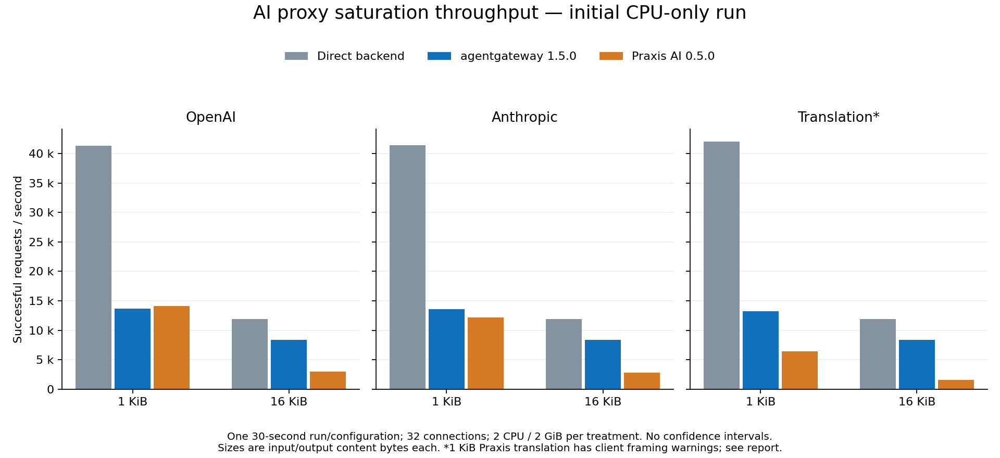
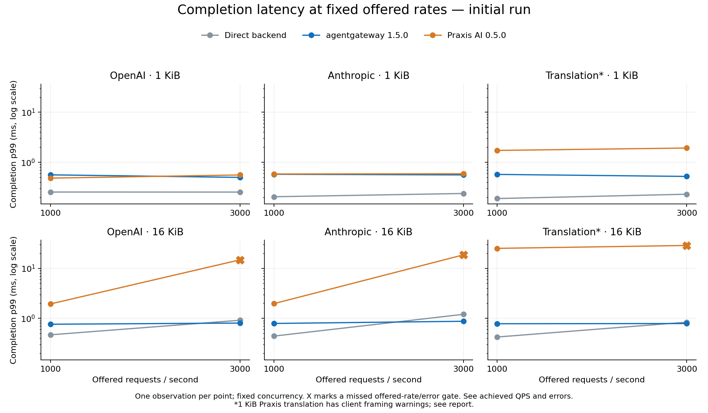

# Initial CPU-only AI gateway results

Run started **2026-10-02 01:43:31 UTC** (October 1 in US Pacific time). One 30-second measurement per configuration; 54 trials and **10,091,467 measured requests**, all HTTP 200. No repeats were run to select a favorable outcome. All 54 preflight protocol checks passed. Inference is paused: no GPU or real model was used.

- [Agentgateway versus direct service](agentgateway-vs-direct.md)
- [Praxis versus agentgateway](praxis-vs-agentgateway.md)
- [All numeric observations](summary.csv)
- [Raw evidence archive](raw.tar.gz), including every Fortio log/histogram, approximate Docker resource samples, configurations, image inspections, protocol outcomes and original per-file SHA-256 checksums
- [Manifest](manifest.json), [CPU topology](cpu-topology.txt), [archive checksums](SHA256SUMS)

## Observations

At saturation with 32 connections, agentgateway handled 16 KiB native OpenAI and Anthropic workloads at **2.81× and 2.97×** Praxis AI's successful QPS. Translation at 16 KiB was **5.41×**. At 1 KiB, Praxis handled OpenAI at **1.030×** agentgateway's QPS; agentgateway handled Anthropic at **1.121×** Praxis's QPS. Small differences are not statistically established by one observation.

The 1 KiB translation result is retained but **confounded by client behavior**: Praxis responses triggered nearly one Fortio `Content-length missing` warning per request. Different framing/connection handling and logging can influence results. Its observed 2.05× agentgateway/Praxis ratio is not a clean estimate of translation CPU cost. The other five workload/size combinations did not emit this warning.

Agentgateway and the direct baseline met the registered offered-rate/error gate in all fixed-rate cases. Praxis missed it at 3,000 QPS for all three 16 KiB cases, achieving 2,953.6 / 2,773.2 / 1,548.3 successful QPS for OpenAI / Anthropic / translation. The gate is at least 99% of offered QPS with at most 0.1% errors; a throughput miss is not an HTTP error.





## Environment and interpretation

Dedicated GCP n2-standard-16 VM, Intel Cascade Lake, 16 logical CPUs / 8 guest-reported physical cores, approximately 64 GiB RAM. Native Linux amd64. Each gateway receives two distinct physical-core threads and a 2 GiB limit; mock and client receive separate two-core sets. Both gateways were never under load simultaneously. The host was deleted after evidence export. See the recorded CPU topology rather than assuming disjoint CPU IDs prove core isolation.

The direct service establishes backend capacity for this harness, not a zero-overhead theoretical limit. Its own saturation changes substantially with payload size. Agentgateway achieves approximately 31–33% of the small-payload direct rate and 70–71% of the large-payload direct rate. Those ratios are not production capacity forecasts. Saturation p99 values occur at different achieved rates and cannot be subtracted as added latency.

The comparison uses the released agentgateway v1.5.0 and Praxis AI 0.5.0 images, pinned by digest. Both perform AI-aware routing; their internal work differs. Tests use HTTP/nonstreaming requests, mock content and constant synthetic usage. Streaming and 429 behavior were qualified at low load, not measured under sustained load. No TLS, external auth, distributed rate limiting, cache, guardrails or GPU serving was enabled.

One round cannot estimate between-run variability. A future approved campaign should repeat/counterbalance the cases, investigate translation framing, cross-check with a second load generator, and add production policy/streaming workloads. This is an initial report, not a universal ranking or a statement about model quality, token throughput, inference routing, or GPU efficiency.

## Reproduce the reports

From this directory:

```sh
sha256sum -c SHA256SUMS
mkdir extracted
tar -xzf raw.tar.gz -C extracted
python3 ../../report.py --campaign extracted/ai-initial-001 --output derived --evidence-link ../raw.tar.gz
python3 -m pip install -r ../../plot-requirements.txt
python3 ../../plots.py --campaign extracted/ai-initial-001 --output derived
```

The source harness is two directories above. Use `--initial` for the same single-round matrix. Container image digests, commands, CPU sets, synthetic requests, fixture hashes and tool versions are retained in the archive. Figures were rendered with matplotlib 3.10.6. The archive contains no cloud credentials or Kubernetes kubeconfig.
