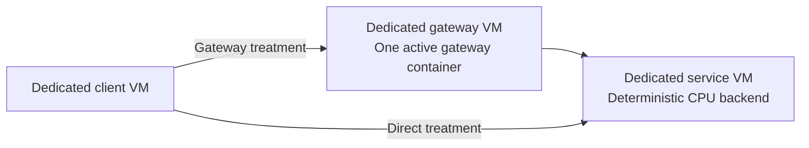
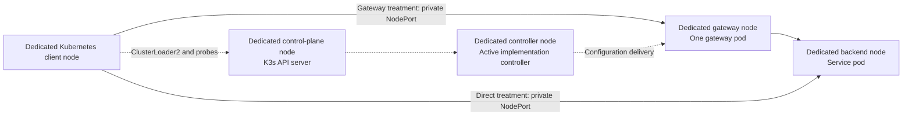

# What each measured request traverses

All eight VMs belong to the same GCE project and zone. Benchmark traffic uses
private IP addresses. External IPs carry administration only. GKE, a managed GCP
load balancer and an intermediary Envoy proxy are absent.

## Standalone forwarding and native AI

The client runs Fortio, Nighthawk or AIPerf sequentially. Nighthawk is the load
client; it does not insert an Envoy gateway into the request path. Each gateway
container uses host networking, a two-vCPU quota, guest CPUs 2 and 3, and 2 GiB.
Inactive gateway containers are stopped. Common forwarding and native AI never
run concurrently on these hosts.

The common profile compares direct service, agentgateway v1.6.0, Praxis core
v0.5.2 and core nightly-20261002. The native profile compares direct service,
agentgateway v1.6.0, Praxis AI v0.5.0 and the October 2 AI nightly. They use the
same physical roles but different configurations and responsibilities.

## Kubernetes HTTP, configuration changes and recovery

The five nodes have separate roles. Gateway pods have a two-vCPU limit and
256 MiB; their guest cores are not pinned. The active implementation controller
has two replicas on its own node. The other implementation's controller is
stopped. HTTP uses the private NodePort path. MetalLB supplies an address for
Gateway status and the focused static-address test; it is not a managed GCP
load balancer or an extra HTTP proxy. The focused upstream static-address case
checks address validation/assignment and status; it does not probe HTTP through
the assigned VIP. External VIP reachability is outside this campaign.

Route scale tests use the same gateway path to verify every route after checking
current-generation status. Recovery tests use ten scheduled HTTP probes per
second while restarting the controller or deleting the sole data-plane pod.
One desired data-plane replica is intentional. Steady-state HTTP waits for one
stable pod and endpoint; induced graceful deletion can overlap a draining pod
and its replacement. These recovery probes cannot establish high availability.

The stock Praxis operator/core nightly pairing fails during setup. Its dependent
Kubernetes HTTP, scale and recovery cells are not evaluated. Core nightly remains
a separately measured standalone treatment.

## Comparing the paths

The direct reference includes the client, network and service path. Unlimited
traffic can exhaust that path; it is not an unconstrained backend ceiling. Adding
a gateway changes both processing and network traversal. Ratios describe the
configured paths, not isolated CPU cycles spent in the proxy.

Standalone and Kubernetes use different memory limits, CPU placement and network
paths. Comparing their raw numbers does not isolate Kubernetes overhead. Within
each profile, keep the direct baseline, fixed-rate results, unlimited-rate results,
errors and resource evidence together. See [methodology](../reports/05-methodology-and-validity.md)
and [protocol](PROTOCOL.md) for exact workload and validity boundaries.
